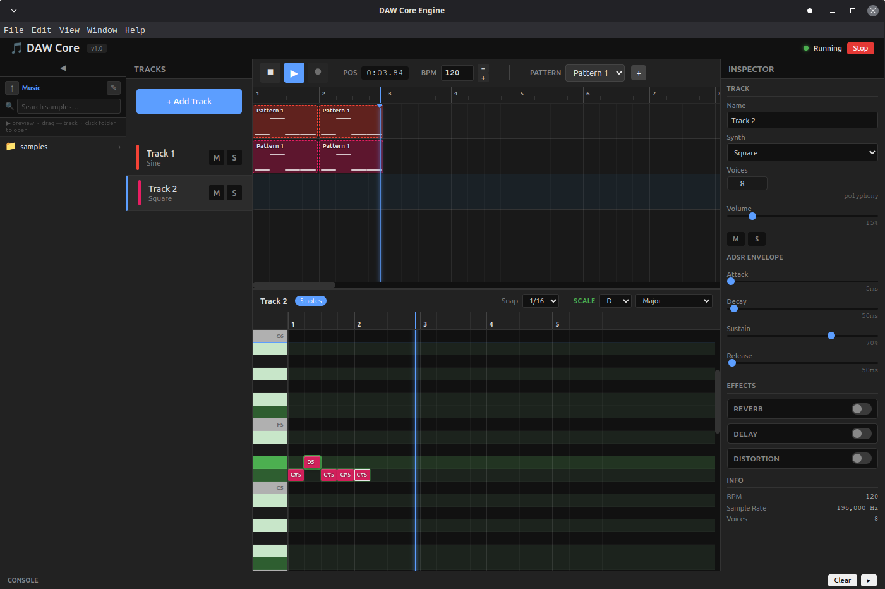

# DAW Core Engine

A real-time digital audio workstation engine written in C++23, paired with an Electron + React frontend.
The engine runs as a standalone process; the UI talks to it over a stdin/stdout JSON-command bus.

---

## Preview



---

## Features

| Area | Details |
|---|---|
| **Audio engine** | Zero-heap-allocation render loop, 512-sample blocks, PulseAudio output on Linux |
| **Synthesisers** | Sine, Square, Sawtooth, PWM oscillators — fully polyphonic with per-voice ADSR |
| **Sampler** | WAV / FLAC / OGG loader via libsndfile, pitch-shifted via linear-interpolation SRC |
| **Effects** | Freeverb-style reverb, tape-delay, soft-clip distortion — per-track effect chains |
| **Timeline** | Beat-accurate event queue, multi-track arrangement, loop playback with auto-wrap |
| **Piano Roll** | Per-track MIDI editor with scale highlighting (15 scales), snap, velocity editing |
| **Automation** | Per-track / per-effect automation lanes with linear interpolation |
| **Sample browser** | Integrated file browser rooted at `~/Music`, preview playback, drag-to-track |
| **Solo / Mute** | Exclusive solo (engine-enforced), immediate note-off on silence |
| **Frontend** | Electron + React + Zustand — resizable panels, dark theme, keyboard shortcuts |

---

## Architecture

For a full class diagram, component relationships, data-flow diagrams, and design-pattern rationale see:

➡ **[ARCHITECTURE.md](ARCHITECTURE.md)**

The document covers the full C++ object hierarchy (`AudioBlock → Instrument → SimpleSynth / SamplePlayer`),
the render loop, the command queue, and extension points for new oscillators, instruments, and effects.

It also includes the **Frontend ↔ Engine communication** protocol (JSON-over-stdin/stdout via Electron IPC) —
see the *"Frontend ↔ Backend Communication"* section.

---

## Quick Start

### Prerequisites

| Tool | Version |
|---|---|
| CMake | ≥ 3.25 |
| GCC / Clang | C++23 |
| libpulse-dev | any recent |
| libsndfile-dev | any recent |
| Node.js | ≥ 20 |
| npm | ≥ 10 |

### Build & run

```bash
# 1 — Build the engine
mkdir -p cmake-build-debug && cd cmake-build-debug
cmake .. -DCMAKE_BUILD_TYPE=Debug
ninja DAWCoreEngine
cd ..

# 2 — Install frontend dependencies
cd frontend && npm install

# 3 — Launch (starts Electron + engine automatically)
npm run dev          # development (Vite + Electron)
# or
npm run build && npm run electron   # production build
```

---

## Project Layout

```
DAWCoreEngine/
├── src/                     # C++ engine source
│   ├── CoreServiceEngine    # PulseAudio thread + render-loop host
│   ├── render_loop/         # RenderLoop, Timeline, Track, Voice, Effects …
│   └── commands/            # JSON command parser + API routing
├── frontend/
│   ├── electron/            # Electron main process + preload (IPC bridge)
│   └── src/                 # React UI — Timeline, PianoRoll, Inspector …
├── ARCHITECTURE.md          # Deep-dive class diagrams & data-flow
└── images/
    └── preview.png
```

---

## License

MIT — free to use, modify, and distribute.
